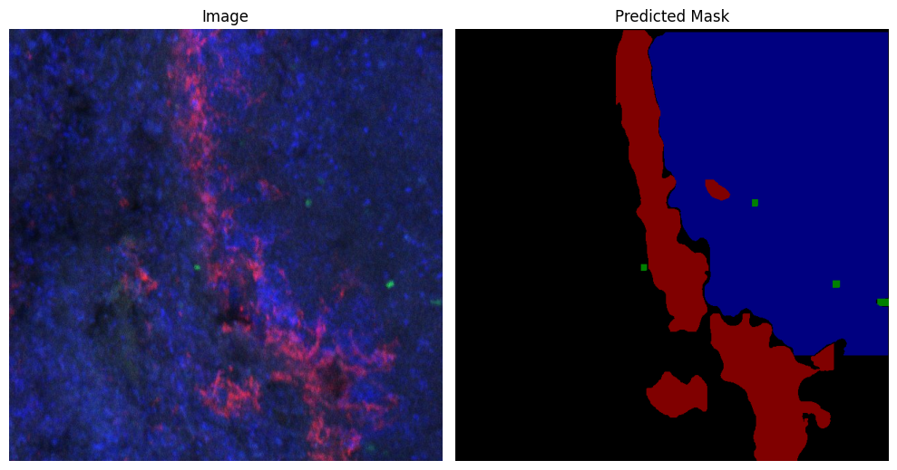

# Instance Segmentation in spleen

### Project description
#### Objective
Oncolytic viruses are used to fight cancer via multipe mechanisms including immunomodulation. The latter is mediated by infection of the distinct cell populations in the spleen. We wanted to quantify the area of infected cells as well as histological structures on immunofluorescent slices in murine spleens.
#### Custom dataset and training
For these purpose, we used semantic segmentation to map 4 classes of objects - infected B cells, infected CD169 cells, white pulp and marginal zone (CD169 cells). Custom dataset (train set - 579, valid set - 51, test - 28 images)was created in Roboflow. The YOLOv8-seg model was trained with specific set of augmentations 

#### Results
Despite limited number of images available for training we've got mAP50(M) = 75% on validation dataset. Test images were used to vizualize the efficacy of automatic vs manual segmentation. Finally, model predictions wer eused to quantify the areas of the objects of interest.

#### Data availability
Custom dataset and model weights are available on Roboflow.
