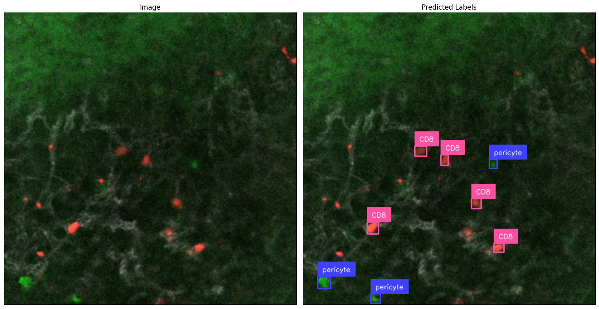

# Object detection in tumor

### Project description
#### Objective
Oncolytic viruses selectively infect cells in tumor microenvironment and attract CD8 T cells to kill tumor cells. We wanted to quantify the number of infected perivascular cells (pericytes) and number of CD8 T cells on intravital fluorescent images in murine tumor models.
#### Custom dataset and training
For these purpose, we used YOLOv11 to detect 2 classes of objects - infected cells (pericytes) and CD8s. Custom dataset (train set - 633, valid set - 56, test - 19 images) was created in Roboflow. The YOLOv11 model was trained with specific set of augmentations 

#### Results
We've got mAP50(M) = 86,3% on validation dataset. Test images were used to vizualize the efficacy of automatic vs manual detection. Finally, model predictions were used to quantify the number of detected cells in different experimental conditions. Automatic object detection allowed to save time and to avoid human bias that is inevitable in manual labelling

#### Data availability
Custom dataset and model weights are available on Roboflow.
